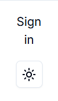
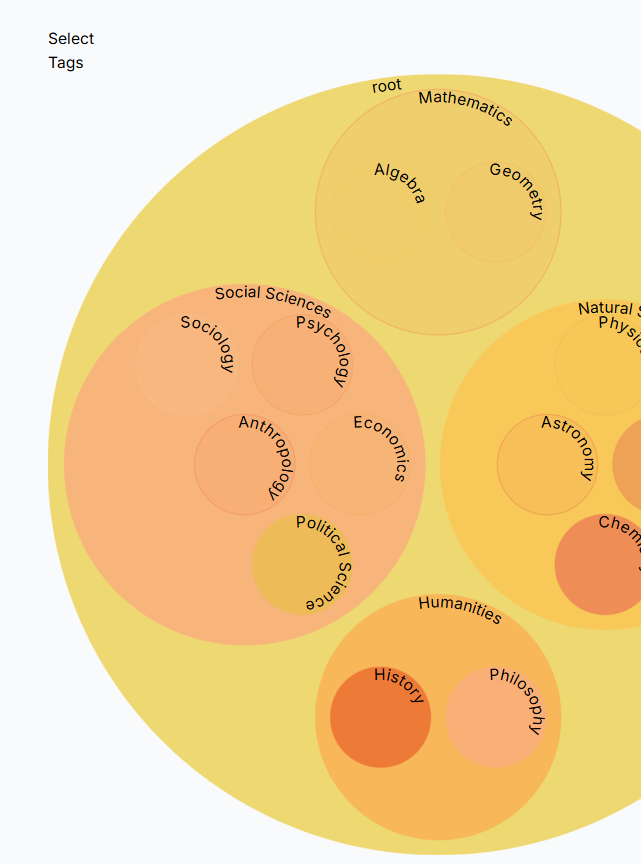
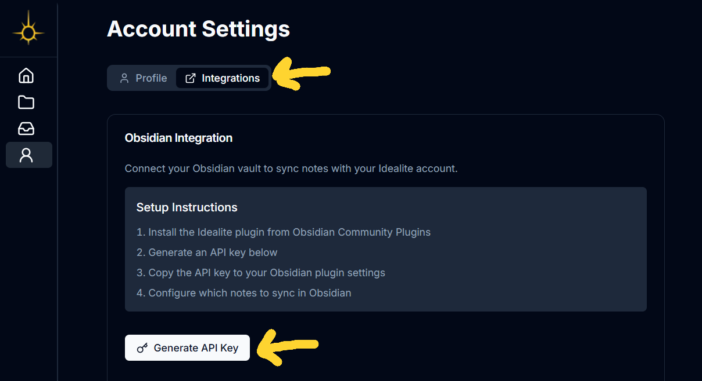
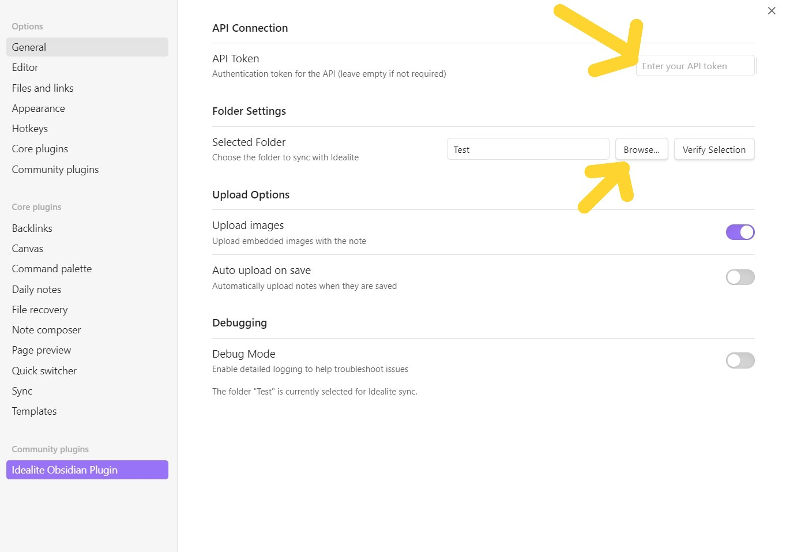

# Idealite Obsidian Plugin

Transform your note-taking into progressive learning. Upload your markdown notes to Idealite where they're enhanced with AI-powered features like automatic tagging, flashcard generation, and intelligent organization.

## How Idealite upgrades progressive summarization into progressive learning

-   **Turn distillation into action**: Instead of endlessly shrinking notes into smaller blocks, Idealite converts them into flashcards you can do right away.
-   **Automates the busywork**: Hit save, and the app auto-tags your note, adds rich metadata, and generates flashcards
-   **Surface real gaps**: Idealite tracks which cards you miss, back-links to the exact passages you struggle with, and puts only those in your queue.
-   **Keeps you in the 'active' zone**: By skipping everything you've already mastered, every session is deliberate practice, not passive reading.
-   Extra features
    -   **Built-in metrics**
    -   **Method-of-Loci 2.0**

### Quick guide: adding front-matter that Idealite understands

1. Put a YAML block at the very top of the note

-   Begin and end with `---`, no blank lines before the opening fence.
-   Use spaces (not tabs) for indention.

2. Adding books

-   Write each entry as "Title by Author" (or an object with title & author)

```
books:
  - Atomic Habits by James Clear
  - { title: "Peak", author: "Anders Ericsson" }   # object form also works
```

-   During upload Idealite hits OpenLibrary, fetches cover art & metadata, and links the book to your note.

3. Adding URLs

```
urls:
  - https://www.gatesnotes.com/Energy/My-new-favorite-battery-breakthrough
  - https://x.com/someuser/status/987654321
```

-   Each URL is looked up (Twitter/X or generic open-graph) and saved as a resource, complete with title, description, preview image, and publication date when available.

## How to use

### 1. Create an account

-   Click on the sign button in the bottom left corner
-   

### 2. Grab tags so that the auto-tagging works

-   Go to workspace page by clicking the folder icon in the left side navigation bar.
-   Click on the Compass button to go to tag selection page
-   
-   Click on any of the circles to select tags.
-   

### 3. Connect your account to Obsidian with an API key

-   Go to the profile page by clicking on the user icon in the left side navigation bar.
-   Click on the integrations button under the Account Settings header
-   Click Generate API key button and copy the token
-   

### 4. Select a folder in the settings

-   After installing the Idealite Obsidian plugin
-   Click on the settings button next to the vault button
-   Click on the Idealite Obsidian Plugin in the Community Plugins
-   In the settings, paste in the API key in the API Token and select a folder by click on the Browse... button.
-   
-   Your notes in the selected folder will be uploaded and processed into flashcards and notes on Idealite.

To update the version run `npm version patch`
